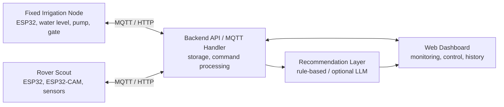

# AgroTitan-AI

Smart Hybrid Paddy Monitoring & Irrigation Control System.

AgroTitan-AI adalah prototype smart agriculture berbasis ESP32 dan ESP32-CAM
untuk pemantauan kondisi lahan padi, kontrol irigasi, inspeksi visual tanaman,
dan rekomendasi tindakan awal melalui web dashboard.

Proyek ini dirancang untuk final project UAS Sistem Mikroprosesor dengan pendekatan arsitektur hybrid: fungsi irigasi dibuat stabil pada node tetap, sementara inspeksi visual dilakukan oleh rover yang dioperasikan secara berkala.

## Tim 6 - TIF RP 23 CID A

| Nama | NIM |
| --- | --- |
| Doni Setiawan Wahyono | 23552011146 |

## Status Proyek

| Item | Keterangan |
| --- | --- |
| Status | Prototype planning and implementation scaffold |
| Objek implementasi | Miniatur lahan padi / simulasi galengan sawah |
| Platform utama | Web dashboard, firmware ESP32, dan backend API |

## Konsep Utama

AgroTitan-AI memisahkan sistem menjadi dua unit fisik yang saling melengkapi:

| Unit | Peran |
| --- | --- |
| Fixed Irrigation Node | Node permanen untuk membaca tinggi air, mengontrol pompa, mengontrol pintu air, dan mengirim telemetri real-time. |
| Rover Scout | Rover berbasis ESP32-CAM untuk inspeksi visual tanaman padi, pembacaan data lingkungan, dan patroli pada jalur galengan miniatur. |
| Web Dashboard | Pusat monitoring, kontrol, histori, preview gambar, alert, dan rekomendasi tindakan awal. |

Sistem rekomendasi bersifat **decision support**, bukan pengambil keputusan
final. Jika integrasi AI API belum tersedia, rekomendasi tetap dapat berjalan
dengan rule-based logic.

## Arsitektur Sistem

Layer utama:

| Layer | Tanggung Jawab |
| --- | --- |
| Fixed Node Layer | Sensor tinggi air, relay pompa, servo gate atau solenoid valve, LED, buzzer, dan telemetri. |
| Rover Layer | Motor DC, line follower, obstacle detection, ESP32-CAM, sensor lingkungan, dan pengiriman gambar. |
| Communication Layer | MQTT atau HTTP untuk telemetri dan command. |
| Backend Layer | API server, database, handler MQTT/HTTP, command processing, dan penyimpanan gambar. |
| Web Dashboard Layer | Monitoring real-time, histori, kontrol manual/otomatis, preview gambar, dan alert. |
| Recommendation Layer | Analisis data gabungan untuk menghasilkan rekomendasi tindakan awal. |

