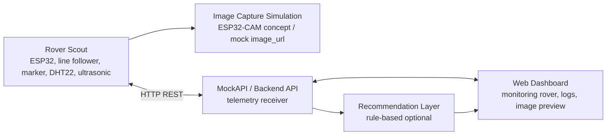

# AgroTitan-AI

Rover Scout prototype for smart paddy field inspection.

AgroTitan-AI adalah prototype smart agriculture berbasis ESP32 untuk inspeksi
kondisi lahan padi pada miniatur galengan sawah. Implementasi terbaru proyek ini
difokuskan pada **Rover Scout** saja, tanpa menggunakan Fixed Irrigation Node
atau node irrigation.

Project plan sebelumnya mendesain AgroTitan-AI sebagai sistem hybrid yang terdiri
dari Fixed Irrigation Node, Rover Scout, dan Web Dashboard. Untuk kebutuhan
implementasi UAS saat ini, scope dipersempit agar prototype lebih realistis
diselesaikan: rover menjadi unit utama untuk navigasi, pembacaan lingkungan,
deteksi obstacle, simulasi pengambilan gambar tanaman, dan pengiriman telemetri.

## Kelompok 6 - TIF RP 23 CID A

| Nama | NIM |
| --- | --- |
| Doni Setiawan Wahyono | 23552011146 |
| Riki Gusti Fernanda | 23552011081 |
| Naufal Aulia Nuchrizal | 23552011366 |

## Status Proyek

| Item | Keterangan |
| --- | --- |
| Status | Prototype Rover Scout dalam tahap implementasi dan simulasi |
| Scope aktif | Rover Scout saja |
| Scope tidak digunakan | Fixed Irrigation Node / node irrigation |
| Objek implementasi | Miniatur lahan padi dengan jalur galengan |
| Platform simulasi | Wokwi + PlatformIO |
| Komunikasi data | HTTP REST ke MockAPI atau backend |

## Keputusan Scope

Implementasi saat ini tidak lagi membangun arsitektur hybrid penuh. Perubahan
scope dilakukan agar fokus proyek lebih jelas dan dapat didemonstrasikan secara
end-to-end.

| Komponen | Status Implementasi | Catatan |
| --- | --- | --- |
| Rover Scout | Aktif | Menjadi fokus utama prototype dan demo. |
| Web Dashboard / Backend | Opsional / pendukung | Dapat digunakan untuk menerima telemetri rover dan menampilkan data. |
| Fixed Irrigation Node | Tidak digunakan | Tetap ada sebagai referensi project plan lama, bukan target implementasi saat ini. |
| Kontrol pompa/gate irigasi | Tidak digunakan | Tidak menjadi fitur demo Rover Scout. |

## Konsep Utama

Rover Scout berjalan pada lintasan galengan miniatur menggunakan sensor line
follower. Saat rover menemukan marker zona pengamatan, rover berhenti, membaca
data lingkungan, membuat simulasi capture gambar tanaman, lalu mengirimkan
telemetri ke endpoint HTTP.

Fungsi utama Rover Scout:

- Mengikuti jalur galengan miniatur.
- Berhenti pada marker zona pengamatan.
- Membaca suhu dan kelembapan udara.
- Mendeteksi obstacle di depan rover.
- Memberi indikator lokal melalui LED dan buzzer.
- Menghasilkan `image_url` simulasi untuk mewakili hasil capture ESP32-CAM.
- Mengirim telemetri rover ke MockAPI atau backend.

Sistem rekomendasi, jika dibuat, bersifat **decision support**. Pada scope rover
saja, rekomendasi dapat dibuat dari status visual tanaman, suhu, kelembapan,
status obstacle, dan zona pengamatan.

## Arsitektur Sistem

Layer utama:

| Layer | Tanggung Jawab |
| --- | --- |
| Rover Control Layer | State machine rover, tombol start/stop, line follower, marker zona, dan simulasi motor. |
| Sensor Layer | DHT22 untuk suhu/kelembapan dan HC-SR04 untuk obstacle detection. |
| Visual Inspection Layer | Simulasi capture gambar tanaman melalui `image_url` dan status visual tanaman. |
| Communication Layer | Pengiriman telemetri rover menggunakan HTTP REST. |
| Dashboard Layer | Monitoring status rover, zona, sensor, obstacle, dan preview gambar. |
| Recommendation Layer | Rule-based recommendation opsional dari data rover. |

## Fitur Rover Scout

- Mode `IDLE`, `PATROL`, `STOPPED_AT_ZONE`, dan `OBSTACLE`.
- Tombol `START_PATROL` untuk memulai patroli.
- Tombol `STOP_ROVER` untuk menghentikan rover.
- Navigasi line follower berbasis tiga input sensor: kiri, tengah, kanan.
- Deteksi marker zona untuk memicu proses inspeksi.
- Pembacaan suhu dan kelembapan menggunakan DHT22.
- Deteksi obstacle menggunakan ultrasonic HC-SR04.
- Simulasi motor kiri dan kanan menggunakan LED.
- LED status untuk mode patroli.
- Buzzer sebagai alarm saat obstacle terdeteksi.
- Simulasi capture gambar tanaman dengan `image_url`.
- Status visual tanaman: `NORMAL`, `PERLU_INSPEKSI`, atau `UNKNOWN`.
- Pengiriman payload telemetri secara berkala ke endpoint HTTP.

