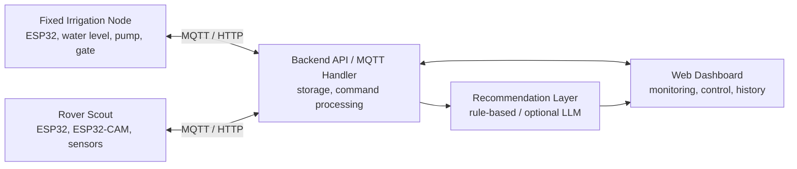

# AgroTitan-AI

Smart Hybrid Paddy Monitoring & Irrigation Control System.

AgroTitan-AI adalah prototype smart agriculture berbasis ESP32 dan ESP32-CAM
untuk pemantauan kondisi lahan padi, kontrol irigasi, inspeksi visual tanaman,
dan rekomendasi tindakan awal melalui web dashboard.

Proyek ini dirancang untuk final project UAS Sistem Mikroprosesor dengan pendekatan arsitektur hybrid: fungsi irigasi dibuat stabil pada node tetap, sementara inspeksi visual dilakukan oleh rover yang dioperasikan secara berkala.

## Tim 6 - TIF RP 23 CID A

| Nama | NIM |
| --- | --- |
| Doni Setiawan Wahyono | 23552011146 |
|Riki  Gusti Fernada | 23552011081 |
|Naufal Aulia Nuchrizal| 23552011366 |


## Status Proyek

| Item | Keterangan |
| --- | --- |
| Status | Prototype planning and implementation scaffold |
| Objek implementasi | Miniatur lahan padi / simulasi galengan sawah |
| Platform utama | Web dashboard, firmware ESP32, dan backend API |

## Konsep Utama

AgroTitan-AI memisahkan sistem menjadi dua unit fisik yang saling melengkapi:

| Unit | Peran |
| --- | --- |
| Fixed Irrigation Node | Node permanen untuk membaca tinggi air, mengontrol pompa, mengontrol pintu air, dan mengirim telemetri real-time. |
| Rover Scout | Rover berbasis ESP32-CAM untuk inspeksi visual tanaman padi, pembacaan data lingkungan, dan patroli pada jalur galengan miniatur. |
| Web Dashboard | Pusat monitoring, kontrol, histori, preview gambar, alert, dan rekomendasi tindakan awal. |

Sistem rekomendasi bersifat **decision support**, bukan pengambil keputusan
final. Jika integrasi AI API belum tersedia, rekomendasi tetap dapat berjalan
dengan rule-based logic.

## Arsitektur Sistem



Layer utama:

| Layer | Tanggung Jawab |
| --- | --- |
| Fixed Node Layer | Sensor tinggi air, relay pompa, servo gate atau solenoid valve, LED, buzzer, dan telemetri. |
| Rover Layer | Motor DC, line follower, obstacle detection, ESP32-CAM, sensor lingkungan, dan pengiriman gambar. |
| Communication Layer | MQTT atau HTTP untuk telemetri dan command. |
| Backend Layer | API server, database, handler MQTT/HTTP, command processing, dan penyimpanan gambar. |
| Web Dashboard Layer | Monitoring real-time, histori, kontrol manual/otomatis, preview gambar, dan alert. |
| Recommendation Layer | Analisis data gabungan untuk menghasilkan rekomendasi tindakan awal. |


Riki:

## Fitur

### Fixed Irrigation Node

- Membaca tinggi air secara real-time.
- Mengirim data sensor dan status aktuator ke backend.
- Mengontrol pompa air secara manual atau otomatis.
- Mengontrol pintu air menggunakan servo gate atau solenoid valve.
- Mendukung input rain sensor sebagai data tambahan.
- Menyediakan indikator lokal melalui LED dan buzzer.
- Tetap dapat menjalankan logika lokal saat koneksi backend terputus sementara.

### Rover Scout

- Bergerak mengikuti jalur galengan miniatur menggunakan sensor line follower.
- Berhenti pada marker zona pengamatan.
- Mengambil gambar tanaman padi menggunakan ESP32-CAM.
- Membaca suhu dan kelembapan udara.
- Mendeteksi obstacle dan mengirim alert ke dashboard.
- Mendukung command dari dashboard seperti start patrol, stop rover, dan capture image.

### Web Dashboard

- Monitoring status fixed node: tinggi air, pompa, gate, dan hujan.
- Monitoring status rover: online/offline, mode patroli, posisi zona, dan alert.
- Preview gambar tanaman terbaru beserta zona dan timestamp.
- Histori data sensor, log command, log patroli, dan histori irigasi.
- Kontrol manual untuk pompa, gate, rover, capture image, dan auto mode.
- Rekomendasi tindakan awal berdasarkan data air, lingkungan, dan inspeksi visual.

## Struktur Repository

```text
AgroTitan-AI/
|-- assets/                      # Media, gambar demo, poster, atau aset dokumentasi
|-- backend/                     # API server, database layer, MQTT/HTTP handler
|-- docs/                        # Dokumentasi teknis, wiring, laporan, dan referensi
|-- firmware/
|   |-- esp32-cam/               # Firmware kamera / image capture
|   |-- fixed-irrigation-node/   # Firmware fixed node irigasi
|   `-- rover-scout/             # Firmware rover dan navigasi
|-- frontend/                    # Web dashboard
|-- hardware/                    # Skema wiring, desain mekanik, BOM
|-- scripts/                     # Helper scripts untuk build, test, atau tooling
`-- README.md
```

## Tech Stack

| Area | Teknologi |
| --- | --- |
| Firmware | Arduino IDE atau PlatformIO |
| Microcontroller | ESP32, ESP32-CAM |
| Communication | MQTT atau HTTP REST |
| MQTT Broker | Mosquitto atau HiveMQ |
| Backend | Laravel atau Node.js |
| Database | MySQL atau Firebase |
| Frontend | React atau Laravel Blade |
| Image Upload | Multipart upload atau Base64 |
| Recommendation | Rule-based logic, optional Gemini API atau OpenAI API |

> Catatan: pilihan stack final dapat disesuaikan dengan implementasi aktual.
> Dokumentasikan keputusan final pada `docs/` setelah backend, frontend, dan
> firmware mulai dikembangkan.

## Data dan Komunikasi

### MQTT Topics

| Topic | Fungsi |
| --- | --- |
| `agrotitan/fixed-node-01/telemetry` | Data sensor dan status fixed node. |
| `agrotitan/fixed-node-01/command` | Command untuk pompa dan gate. |
| `agrotitan/rover-01/status` | Status rover dan posisi zona. |
| `agrotitan/rover-01/image` | Notifikasi gambar baru dari ESP32-CAM. |
| `agrotitan/rover-01/alert` | Alert obstacle, rover diangkat, atau gangguan rover. |

### Fixed Node Payload

```json
{
  "node_id": "FIXED-NODE-01",
  "water_level": 4.2,
  "pump_status": "OFF",
  "gate_status": "CLOSED",
  "rain_status": false,
  "water_status": "IDEAL",
  "timestamp": "2025-01-15T08:30:00Z"
}
```

### Rover Payload

```json
{
  "rover_id": "ROVER-01",
  "zone": "ZONE-02",
  "rover_status": "STOPPED",
  "temperature": 31.2,
  "humidity": 78,
  "image_url": "/images/rover/zone02_20250115.jpg",
  "plant_visual_status": "normal",
  "timestamp": "2025-01-15T08:32:00Z"
}
```

## Logika Otomatisasi

### Kontrol Irigasi

```pseudo
if water_level < MIN_LEVEL:
    status = "AIR_RENDAH"
    open_gate()
    activate_pump()
    send_alert("Air di bawah batas minimum")

elif MIN_LEVEL <= water_level <= MAX_LEVEL:
    status = "AIR_IDEAL"
    close_gate()
    deactivate_pump()

elif water_level > MAX_LEVEL:
    status = "AIR_TERLALU_TINGGI"
    close_gate()
    deactivate_pump()
    send_alert("Air melebihi batas maksimum")
```

### Patroli Rover

```pseudo
on_command("START_PATROL"):
    rover_start()

    while not end_of_route:
        follow_line()

        if marker_detected:
            rover_stop()
            read_sensors()
            capture_image()
            send_data_to_backend()
            rover_continue()

    rover_return_to_base()
```
