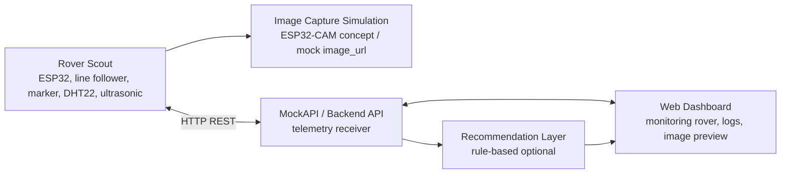
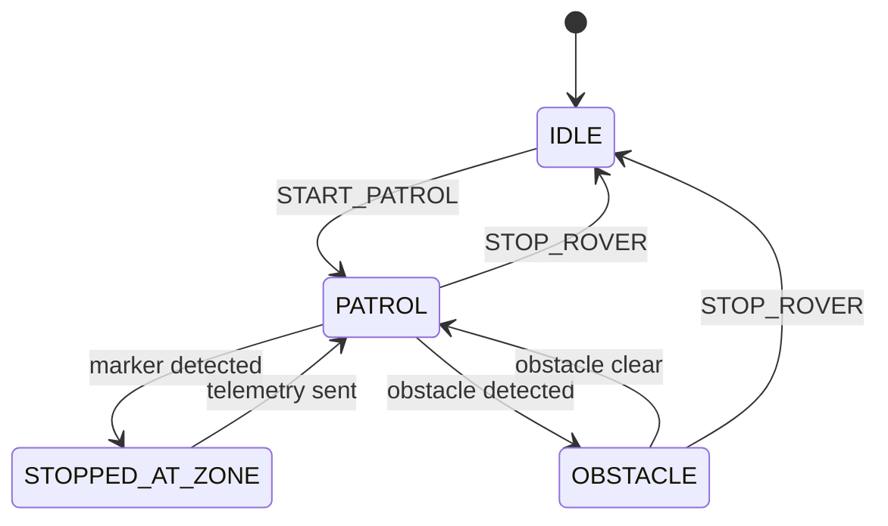

# AgroTitan-AI

Rover Scout prototype for smart paddy field inspection.

AgroTitan-AI adalah prototype smart agriculture berbasis ESP32 untuk inspeksi
kondisi lahan padi pada miniatur galengan sawah. Implementasi terbaru proyek ini
difokuskan pada **Rover Scout** saja, tanpa menggunakan Fixed Irrigation Node
atau node irrigation.

Project plan sebelumnya mendesain AgroTitan-AI sebagai sistem hybrid yang terdiri
dari Fixed Irrigation Node, Rover Scout, dan Web Dashboard. Untuk kebutuhan
implementasi UAS saat ini, scope dipersempit agar prototype lebih realistis
diselesaikan: rover menjadi unit utama untuk navigasi, pembacaan lingkungan,
deteksi obstacle, simulasi pengambilan gambar tanaman, dan pengiriman telemetri.

## Kelompok 6 - TIF RP 23 CID A

| Nama | NIM |
| --- | --- |
| Doni Setiawan Wahyono | 23552011146 |
| Riki Gusti Fernanda | 23552011081 |
| Naufal Aulia Nuchrizal | 23552011366 |

## Status Proyek

| Item | Keterangan |
| --- | --- |
| Status | Prototype Rover Scout dalam tahap implementasi dan simulasi |
| Scope aktif | Rover Scout saja |
| Scope tidak digunakan | Fixed Irrigation Node / node irrigation |
| Objek implementasi | Miniatur lahan padi dengan jalur galengan |
| Platform simulasi | Wokwi + PlatformIO |
| Komunikasi data | HTTP REST ke MockAPI atau backend |

## Keputusan Scope

Implementasi saat ini tidak lagi membangun arsitektur hybrid penuh. Perubahan
scope dilakukan agar fokus proyek lebih jelas dan dapat didemonstrasikan secara
end-to-end.

| Komponen | Status Implementasi | Catatan |
| --- | --- | --- |
| Rover Scout | Aktif | Menjadi fokus utama prototype dan demo. |
| Web Dashboard / Backend | Opsional / pendukung | Dapat digunakan untuk menerima telemetri rover dan menampilkan data. |
| Fixed Irrigation Node | Tidak digunakan | Tetap ada sebagai referensi project plan lama, bukan target implementasi saat ini. |
| Kontrol pompa/gate irigasi | Tidak digunakan | Tidak menjadi fitur demo Rover Scout. |

## Konsep Utama

Rover Scout berjalan pada lintasan galengan miniatur menggunakan sensor line
follower. Saat rover menemukan marker zona pengamatan, rover berhenti, membaca
data lingkungan, membuat simulasi capture gambar tanaman, lalu mengirimkan
telemetri ke endpoint HTTP.

Fungsi utama Rover Scout:

- Mengikuti jalur galengan miniatur.
- Berhenti pada marker zona pengamatan.
- Membaca suhu dan kelembapan udara.
- Mendeteksi obstacle di depan rover.
- Memberi indikator lokal melalui LED dan buzzer.
- Menghasilkan `image_url` simulasi untuk mewakili hasil capture ESP32-CAM.
- Mengirim telemetri rover ke MockAPI atau backend.

Sistem rekomendasi, jika dibuat, bersifat **decision support**. Pada scope rover
saja, rekomendasi dapat dibuat dari status visual tanaman, suhu, kelembapan,
status obstacle, dan zona pengamatan.

## Arsitektur Sistem



Layer utama:

| Layer | Tanggung Jawab |
| --- | --- |
| Rover Control Layer | State machine rover, tombol start/stop, line follower, marker zona, dan simulasi motor. |
| Sensor Layer | DHT22 untuk suhu/kelembapan dan HC-SR04 untuk obstacle detection. |
| Visual Inspection Layer | Simulasi capture gambar tanaman melalui `image_url` dan status visual tanaman. |
| Communication Layer | Pengiriman telemetri rover menggunakan HTTP REST. |
| Dashboard Layer | Monitoring status rover, zona, sensor, obstacle, dan preview gambar. |
| Recommendation Layer | Rule-based recommendation opsional dari data rover. |

## Fitur Rover Scout

- Mode `IDLE`, `PATROL`, `STOPPED_AT_ZONE`, dan `OBSTACLE`.
- Tombol `START_PATROL` untuk memulai patroli.
- Tombol `STOP_ROVER` untuk menghentikan rover.
- Navigasi line follower berbasis tiga input sensor: kiri, tengah, kanan.
- Deteksi marker zona untuk memicu proses inspeksi.
- Pembacaan suhu dan kelembapan menggunakan DHT22.
- Deteksi obstacle menggunakan ultrasonic HC-SR04.
- Simulasi motor kiri dan kanan menggunakan LED.
- LED status untuk mode patroli.
- Buzzer sebagai alarm saat obstacle terdeteksi.
- Simulasi capture gambar tanaman dengan `image_url`.
- Status visual tanaman: `NORMAL`, `PERLU_INSPEKSI`, atau `UNKNOWN`.
- Pengiriman payload telemetri secara berkala ke endpoint HTTP.


## Struktur Repository

```text
AgroTitan-AI/
|-- assets/
|   `-- wiring-diagrams/
|       |-- rover-scout-wiring-diagram.png
|       `-- fixed-irrigation-node-wiring-diagram.png   # referensi scope lama
|-- docs/
|   |-- Project Plan_Kelompok 6_AgroTitan-AI.docx
|   `-- Project Plan_Kelompok 6_AgroTitan-AI.pdf
|-- simulations/
|   `-- wokwi/
|       |-- rover-scout/                               # scope aktif
|       |   |-- src/main.cpp
|       |   |-- platformio.ini
|       |   |-- diagram.json
|       |   |-- libraries.txt
|       |   `-- wokwi.toml
|       `-- fixed-irrigation-node/                     # referensi scope lama
|-- backend/                                           # opsional
|-- frontend/                                          # opsional
|-- firmware/                                          # scaffold / pengembangan lanjutan
`-- README.md
```

## Tech Stack

| Area | Teknologi |
| --- | --- |
| Firmware / Simulasi | Arduino Framework, PlatformIO, Wokwi |
| Microcontroller | ESP32 DevKit; ESP32-CAM sebagai konsep capture gambar |
| Sensor | DHT22, HC-SR04, IR line follower atau switch simulasi |
| Aktuator simulasi | LED motor kiri/kanan, LED status, buzzer |
| Communication | HTTP REST |
| Data Receiver | MockAPI atau backend custom |
| Dashboard | React, Laravel Blade, atau tampilan sederhana berbasis data API |
| Recommendation | Rule-based logic opsional |

## Simulasi Wokwi Rover Scout

Folder simulasi aktif:

```text
simulations/wokwi/rover-scout/
```

File utama:

| File | Fungsi |
| --- | --- |
| `src/main.cpp` | Firmware utama Rover Scout. |
| `diagram.json` | Rangkaian Wokwi. |
| `platformio.ini` | Konfigurasi PlatformIO untuk ESP32. |
| `libraries.txt` | Library Wokwi yang dibutuhkan. |
| `wokwi.toml` | Konfigurasi firmware dan ELF untuk Wokwi. |

### Komponen Simulasi

| Komponen | Fungsi |
| --- | --- |
| ESP32 DevKit | Kontroler utama rover. |
| 3 slide switch | Simulasi sensor line follower kiri, tengah, kanan. |
| 3 push button | Start patrol, stop rover, dan marker zona. |
| HC-SR04 | Deteksi obstacle. |
| DHT22 | Pembacaan suhu dan kelembapan. |
| 2 LED motor | Simulasi motor kiri dan kanan. |
| 1 LED status | Indikator rover sedang aktif patroli. |
| Buzzer | Alarm obstacle. |

### Pin Mapping

| Fungsi | Pin ESP32 |
| --- | --- |
| Line follower kiri | GPIO 32 |
| Line follower tengah | GPIO 33 |
| Line follower kanan | GPIO 25 |
| Tombol start | GPIO 13 |
| Tombol stop | GPIO 16 |
| Tombol marker zona | GPIO 14 |
| Ultrasonic TRIG | GPIO 26 |
| Ultrasonic ECHO | GPIO 27 |
| DHT22 data | GPIO 19 |
| LED motor kiri | GPIO 21 |
| LED motor kanan | GPIO 22 |
| LED status | GPIO 2 |
| Buzzer | GPIO 23 |

Input tombol dan line follower menggunakan mode `INPUT_PULLUP`, sehingga aktif
saat bernilai LOW.

## Data dan Komunikasi

Implementasi saat ini menggunakan HTTP REST. Firmware mengirim payload rover ke:

```text
https://6a199e03489e4715751a3fb6.mockapi.io/api/v1/rover_telemetries
```

Endpoint tersebut dapat diganti ke backend sendiri jika dashboard sudah dibuat.

### Rover Telemetry Payload

```json
{
  "rover_id": "ROVER-01",
  "zone_id": "ZONE-02",
  "rover_status": "STOPPED_AT_ZONE",
  "movement_action": "CAPTURE_IMAGE",
  "temperature": 31.20,
  "humidity": 78.00,
  "obstacle_distance": 25.50,
  "obstacle_status": false,
  "image_url": "/images/rover/ZONE-02_demo.jpg",
  "plant_visual_status": "PERLU_INSPEKSI",
  "timestamp": "123456"
}
```

| Field | Keterangan |
| --- | --- |
| `rover_id` | Identitas rover. |
| `zone_id` | Zona pengamatan saat ini. |
| `rover_status` | Status state machine rover. |
| `movement_action` | Aksi gerak terakhir. |
| `temperature` | Suhu udara dari DHT22. |
| `humidity` | Kelembapan udara dari DHT22. |
| `obstacle_distance` | Jarak obstacle dalam cm. |
| `obstacle_status` | `true` jika obstacle berada di bawah batas aman. |
| `image_url` | URL simulasi hasil capture gambar. |
| `plant_visual_status` | Indikasi visual tanaman. |
| `timestamp` | Timestamp berbasis `millis()` pada firmware simulasi. |

## State Machine Rover



### Alur Patroli

```pseudo
on START_PATROL:
    set rover state to PATROL

while rover state is PATROL:
    read line follower inputs
    move forward, turn left, turn right, or stop if line is lost

    if obstacle distance < safe limit:
        stop rover
        activate buzzer
        send obstacle status

    if marker detected:
        stop rover
        increment zone
        read temperature and humidity
        generate mock image_url
        set plant visual status
        send telemetry
        continue patrol
```